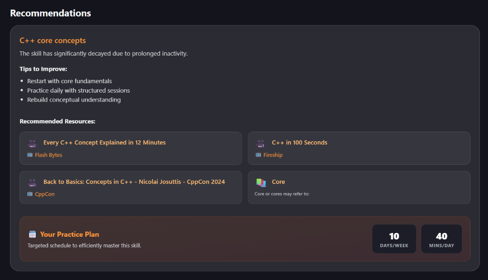
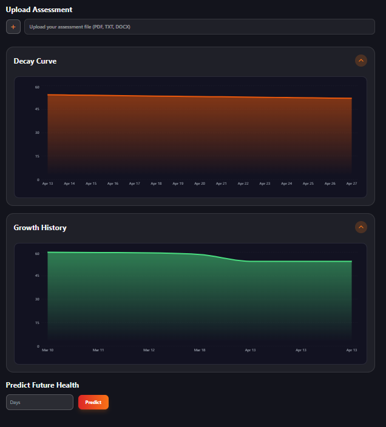
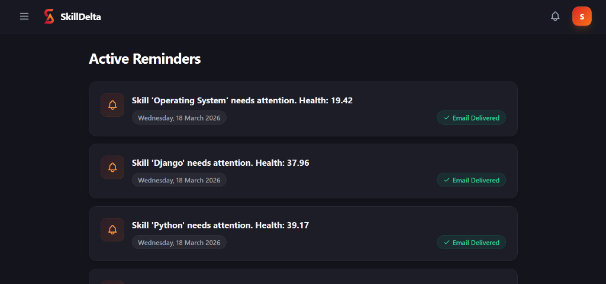
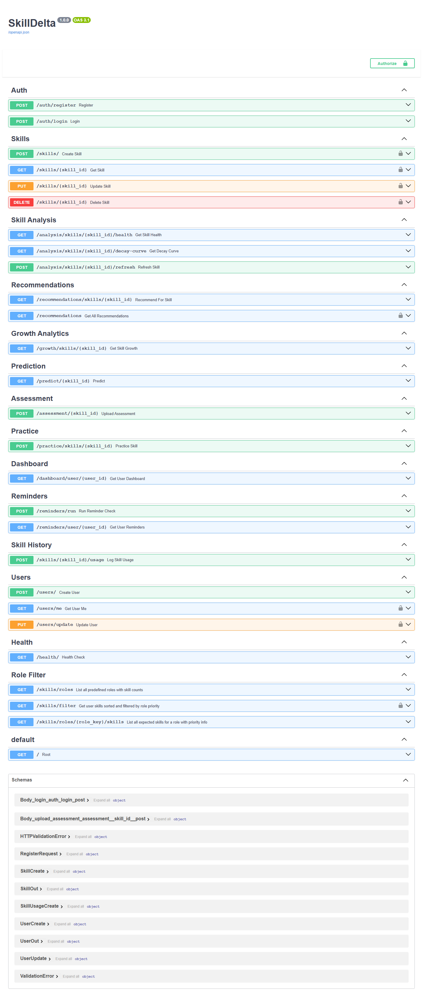

# 🎯 SkillDelta

SkillDelta is a modern full-stack application designed to help users track and manage skill development over time. It features a personalized dashboard that provides insights into learning progress with an intuitive, visually appealing interface.

**Live Demo:** [https://skilldelta.vercel.app](https://skilldelta.vercel.app)  
**Backend API:** [https://samd444-skilldelta.hf.space](https://samd444-skilldelta.hf.space)  
**Repository:** [SAMBHAV001-tech/SkillDelta](https://github.com/SAMBHAV001-tech/SkillDelta)

---

## 📸 Frontend Preview






---

## 🔧 Technology Stack

- **Frontend:** React 19, Vite, Tailwind CSS, Recharts
- **Backend:** FastAPI, Python 3.13, PostgreSQL (SQLAlchemy)
- **Document Processing & AI:** PyTesseract (OCR), PDFPlumber, Groq API
- **Deployment:** Vercel (Frontend), Docker + Hugging Face Spaces (Backend)

---

## 🗄️ Database Design

**Database:** PostgreSQL (Supabase)  
**ORM:** SQLAlchemy

### Key Entities
- **users**: Authentication data and user profiles
- **skills**: User skill tracking and progression metrics
- **subtopics**: Granular topic breakdown under each skill
- **assessments**: Skill evaluation and testing data
- **skill_history**: Logs of historical skill adjustments and activities
- **skill_health_history**: Tracking the decay and health of a skill over time
- **reminders**: Automated notifications configuration

### Core Relationships
- **User → Skills** (One-to-Many)
- **User → Reminders** (One-to-Many)
- **Skill → Assessments / Subtopics / History / Health** (One-to-Many)

*Note: The database relies on strict referential integrity with cascading deletes and efficient SQLAlchemy models.*

---

## 📡 API Endpoints Section

FastAPI routes are cleanly organized into modular domains:

- **Auth & Users APIs**: Login, registration, JWT token management, and profile operations.
- **Skill Core APIs**: CRUD operations for skills, dynamic subtopics, and dashboard aggregations.
- **Assessment & Practice APIs**: Managing evaluation feedback and practice routines.
- **Analytics & History APIs**: Skill analysis, growth visualization, skill health decay, and history tracking.
- **AI & Recommendations APIs**: Machine learning predictions and personalized AI recommendations via Groq.
- **Notifications APIs**: Management of reminders and automated alerts via APScheduler.

<details>
<summary><b>View Deployed Routes</b></summary>

- `/auth` & `/users`
- `/skills` & `/dashboard`
- `/assessment` & `/practice`
- `/skill_history` & `/growth` & `/health`
- `/analysis` & `/predict` & `/recommendations`
- `/reminders`

</details>

---

## 🔗 API Documentation

* **Swagger UI:** `/docs`
* **ReDoc:** `/redoc`



---

## ⚙️ Scalability Architecture

- **FastAPI Async execution:** Asynchronous endpoints heavily utilizing `anyio` for I/O operations.
- **PostgreSQL scaling:** Supabase and Render ready PostgreSQL with robust SQLAlchemy mapping.
- **Background Tasks Engine:** Integrated `APScheduler` for managing scheduled asynchronous jobs like email reminders and decay evaluations without blocking the main event loop.
- **Docker deployment:** Fully containerized backend using `Uvicorn`, deployed to Hugging Face Spaces for stable environment variables and simple infrastructure scaling.
- **Modular Monolith Design:** Clean separation of concerns across `api/`, `services/`, and `db/` directories.

---

## 🚀 Getting Started

### 1. Clone the Repository
```bash
git clone https://github.com/SAMBHAV001-tech/SkillDelta.git
cd SkillDelta
```

### 2. Frontend Setup
```bash
cd frontend
npm install
npm run dev
```
The app will open at `http://localhost:5173/`.

### 3. Backend Setup
```bash
cd backend
python -m venv venv
# Windows: .\venv\Scripts\activate | Mac/Linux: source venv/bin/activate
pip install -r requirements.txt
uvicorn skillrot_app.main:app --host 0.0.0.0 --port 10000
```
API runs on port `10000`. 
Alternatively, use Docker: `docker run -p 10000:10000 $(docker build -q .)`

---

## 🔑 Demo Credentials

### Demo Credentials

Email: sambhavdas444@gmail.com
Password: test123

*(Note: For demo/testing purposes only)*

---

## 📊 Key Features
- ✨ Blazing-fast React frontend with a modern Tailwind CSS gradient design.
- 📚 Comprehensive document/PDF processing and analysis using Tesseract OCR.
- 🤖 Intelligent AI integration via the Groq API.
- 🔐 Secure JWT authentication & PostgreSQL database.

---

## 🤝 Contributing
We welcome contributions! Please create an issue or submit a pull request.

**Support & Docs:**
- Live Project: [https://skilldelta.vercel.app](https://skilldelta.vercel.app)
- Repo: [https://github.com/SAMBHAV001-tech/SkillDelta](https://github.com/SAMBHAV001-tech/SkillDelta)
